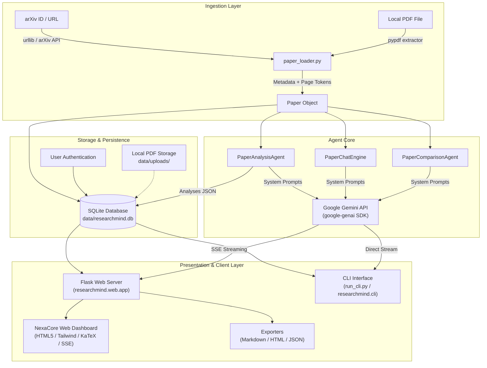
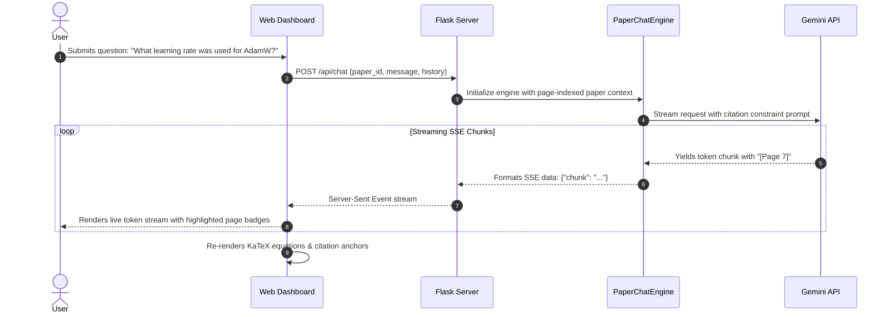
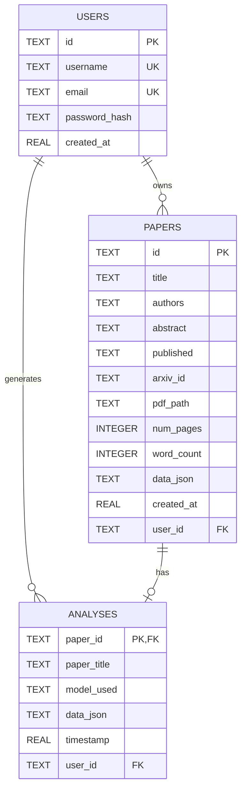

# ResearchMind AI: Comprehensive Project Documentation & Technical Architecture Report

**Version:** 2.0.0  
**Status:** Active / Production-Ready  
**Repository:** [darursrikar-sketch/researchmind-ai](https://github.com/darursrikar-sketch/researchmind-ai)  
**Authors & Maintainers:** ResearchMind AI Development Team  
**Last Updated:** September 2026  

---

## Table of Contents
1. [Executive Summary & Problem Statement](#1-executive-summary--problem-statement)
2. [Core Value Proposition & Capabilities](#2-core-value-proposition--capabilities)
3. [System Architecture & Data Flow](#3-system-architecture--data-flow)
4. [AI Agent Pipeline & Analytical Modules](#4-ai-agent-pipeline--analytical-modules)
5. [Interactive Grounded Chat & Page Citations](#5-interactive-grounded-chat--page-citations)
6. [Cross-Paper Comparative Synthesis Matrix](#6-cross-paper-comparative-synthesis-matrix)
7. [Storage & Database Schema](#7-storage--database-schema)
8. [REST & Server-Sent Events (SSE) API Specification](#8-rest--server-sent-events-sse-api-specification)
9. [User Interface & Design System (NexaCore UI)](#9-user-interface--design-system-nexacore-ui)
10. [CLI & Automation Interface](#10-cli--automation-interface)
11. [Installation, Configuration & Deployment Guide](#11-installation-configuration--deployment-guide)
12. [Verification, Testing & Quality Assurance](#12-verification-testing--quality-assurance)
13. [Future Roadmap & Extensions](#13-future-roadmap--extensions)

---

## 1. Executive Summary & Problem Statement

### 1.1 The Academic Literature Tsunami
Modern scientific research is experiencing exponential growth. In machine learning, computer science, and biomedicine alone, thousands of preprints are submitted to arXiv, bioRxiv, and peer-reviewed venues every week. Researchers, engineers, graduate students, and technical executives face severe bottlenecks:
- **Time Constraints:** Reading a 15–30 page dense paper with mathematical appendices takes 2–4 hours.
- **Surface-Level Summarization:** Standard consumer LLMs offer generic bullet points that miss crucial nuances, fail to evaluate methodological flaws, ignore missing baselines, and hallucinate claims without evidence.
- **Math & Equation Neglect:** Most summarizers skip LaTeX equations, loss functions, and architectural bounds entirely.
- **Fragmented Workflows:** Researchers juggle multiple disconnected tools for paper retrieval, PDF annotation, chat interaction, and literature synthesis.

### 1.2 The ResearchMind AI Solution
**ResearchMind AI** is an autonomous, academic-grade AI research partner designed to bridge the gap between rapid literature scanning and rigorous peer review. Powered by Google Gemini (`gemini-2.5-flash`, `gemini-3.5-flash`, and `gemini-2.5-pro` via the official `google-genai` SDK), ResearchMind provides:
1. Multi-source paper ingestion (instant arXiv resolution or drag-and-drop PDF extraction).
2. Autonomous 6-pillar deep deconstruction (TL;DR, Math/Architecture, Senior Peer Review, Benchmarks, Limitations, Replication Blueprint).
3. Zero-hallucination interactive chat strictly grounded in the paper text with page-level citations (`[Page X]`).
4. Multi-paper cross-comparison matrix for architectural and empirical trade-off analysis.
5. Dual delivery interfaces: a modern glassmorphic web dashboard (inspired by the NexaCore design system) and a headless terminal CLI for scripted automation.

---

## 2. Core Value Proposition & Capabilities

| Capability | Standard LLM Chatbots | ResearchMind AI |
| :--- | :--- | :--- |
| **Ingestion** | Copy-pasting text snippets or raw file dumps | One-click arXiv fetch + Page-aware PDF parsing |
| **Citation Precision** | General text references (prone to hallucination) | Exact page-grounded citations (`[Page 3]`) verified against text |
| **Math & Equations** | Plain text mangling of Greek symbols | Native KaTeX rendering of formulas ($...$, $$...$$) and loss functions |
| **Critical Rigor** | Polite, agreeable summaries | Senior reviewer simulation (NeurIPS/ICML style, 1–10 score, rebuttal questions) |
| **Replication Details** | High-level conceptual overview | Hyperparameters, compute budgets, subtle failure modes, pseudocode |
| **Cross-Paper Analysis**| Ingestion limited to single context | Multi-paper comparative matrix with architectural decision trees |
| **Streaming & UX** | Monolithic text output | Real-time Server-Sent Events (SSE) streaming per module, progress metrics |
| **Export Formats** | Raw copy | Formatted GitHub Markdown, standalone print-ready HTML, structured JSON |

---

## 3. System Architecture & Data Flow

ResearchMind AI is built with a modular, layered architecture ensuring separation of concerns between document processing, prompt engineering, agent orchestration, persistence, and presentation.



### 3.1 Component Breakdown
- **`researchmind.paper_loader`**: Handles document acquisition and text extraction. Interacts with the arXiv Export API (`http://export.arxiv.org/api/query`) to parse Atom XML metadata, downloads source PDFs into `data/uploads/`, and utilizes `pypdf` to maintain an ordered dictionary of page-by-page text buffers.
- **`researchmind.core.prompts`**: Contains meticulously engineered academic system instructions. Enforces JSON formatting constraints, academic tone, LaTeX equation syntax, and page-grounding rules.
- **`researchmind.core.agent`**: Houses `PaperAnalysisAgent`, which orchestrates the execution of the 6 core analysis modules with error handling and fallback logic.
- **`researchmind.core.chat_engine`**: Implements `PaperChatEngine`, a stateful conversational engine with citation extraction, paper-specific question generation, and context truncation safeguards.
- **`researchmind.core.comparative`**: Implements `PaperComparisonAgent`, which accepts multiple paper objects and performs comparative cross-synthesis.
- **`researchmind.storage`**: Manages the local SQLite database (`data/researchmind.db`), schema migrations, user authentication hashing (PBKDF2/SHA-256 via Werkzeug), and user-isolated paper libraries.
- **`researchmind.exporter`**: Serializes paper analyses into clean Markdown, standalone self-contained HTML (with embedded Tailwind and KaTeX stylesheets), or JSON.
- **`researchmind.web.app`**: Flask application providing REST API endpoints and Server-Sent Events (SSE) streaming connections.

---

## 4. AI Agent Pipeline & Analytical Modules

When a paper is ingested, the user can trigger an automated analysis across 6 specialized modules:

```
┌─────────────────────────────────────────────────────────────────────────────┐
│                       RESEARCHMIND 6-PILLAR PIPELINE                        │
├──────────────────────┬──────────────────────┬───────────────────────────────┤
│ 1. Executive Summary │ 2. Methodology & Math│ 3. Critical Peer Review       │
│    • TL;DR & Core    │    • Pipeline Specs  │    • 1-10 NeurIPS Score       │
│    • Headline Metric │    • LaTeX Formulas  │    • Missing Baselines        │
│    • Problem Vector  │    • Loss Functions  │    • Rebuttal Questions       │
├──────────────────────┼──────────────────────┼───────────────────────────────┤
│ 4. Findings & Bounds │ 5. Critical Critique │ 6. Replication Blueprint      │
│    • Datasets Tested │    • Failure Modes   │    • Hyperparameter Table     │
│    • Benchmark Table │    • Scaling Limits  │    • Compute Requirements     │
│    • Ablation Claims │    • Open Questions  │    • Python / Algorithmic Code│
└──────────────────────┴──────────────────────┴───────────────────────────────┘
```

### 4.1 Module Specifications

#### 1. Executive Summary & TL;DR (`executive_summary`)
- **Objective:** Deliver a high-signal overview for rapid triage.
- **Contents:**
  - One-sentence elevator pitch.
  - Core problem formulation and existing paradigm shortcomings.
  - Key technical innovations introduced.
  - Headline quantitative benchmark results (e.g., "+3.2 BLEU over baseline with 40% less memory").

#### 2. Methodology & Architecture (`methodology`)
- **Objective:** Exhaustive deconstruction of model architecture and mathematical formulation.
- **Contents:**
  - Step-by-step algorithmic pipeline from inputs to outputs.
  - Formal mathematical notations and loss functions rendered in clean LaTeX:
    $$\mathcal{L}_{total} = \mathcal{L}_{task} + \lambda \mathcal{L}_{reg}$$
  - Structural diagrams and tensor dimensional transformations.
  - Novel theoretical bounds or mathematical proofs.

#### 3. Critical Peer Review (`peer_review`)
- **Objective:** Simulate a tier-1 conference reviewer (NeurIPS / ICML / ICLR / CVPR).
- **Contents:**
  - Overall Recommendation: Strong Accept / Accept / Weak Accept / Borderline / Reject.
  - Overall Score: Integer rating from 1 (Definite Reject) to 10 (Award Quality).
  - Soundness & Significance: Evaluation of claims vs. empirical support.
  - Missing Baselines: Critical prior art omitted or unfairly compared against.
  - Hard Rebuttal Questions: 3–5 piercing technical inquiries the authors must address.

#### 4. Findings & Benchmarks (`benchmarks`)
- **Objective:** Granular empirical verification.
- **Contents:**
  - Exhaustive inventory of datasets, evaluation protocols, and metrics.
  - Markdown comparison tables highlighting SotA improvements.
  - Key takeaways from ablation studies verifying which components provide real gains.

#### 5. Limitations & Future Work (`limitations`)
- **Objective:** Honest appraisal of boundaries and blind spots.
- **Contents:**
  - Fundamental failure modes and corner cases.
  - Scaling bottlenecks (compute complexity, memory footprints, inference latency).
  - Negative societal impacts or security vulnerabilities (adversarial susceptibility, data leakage).
  - Concrete, actionable directions for follow-up research.

#### 6. Implementation & Replication Blueprint (`implementation`)
- **Objective:** Actionable blueprint enabling an ML engineer to replicate the paper from scratch.
- **Contents:**
  - Structured Markdown table of hyperparameters (learning rates, optimizers, batch sizes, warmup schedules).
  - Compute infrastructure requirements (GPU hours, VRAM per device, distributed topology).
  - Subtle engineering pitfalls and unstated implementation tricks.
  - Python / PyTorch-style pseudocode of the core algorithmic loop.

---

## 5. Interactive Grounded Chat & Page Citations

To eliminate hallucinations common to standard generative LLMs, the **`PaperChatEngine`** employs strict page-grounding prompts:



### Key Chat Features:
1. **Verifiable Page Citations:** The engine references source pages (e.g., `[Page 4]`). The front-end renders these as clickable or highlighted badges.
2. **Automated Starter Questions:** Upon loading a paper, the agent analyzes the abstract and generates 4 tailored, high-value exploratory questions.
3. **Session Preservation:** Chat turns are maintained in-memory and in local history, allowing contextual follow-up questions.

---

## 6. Cross-Paper Comparative Synthesis Matrix

When analyzing a research domain, researchers rarely read papers in isolation. The **`PaperComparisonAgent`** allows users to select two or more papers from their library to generate an automatic comparative meta-analysis.

### Synthesis Components:
1. **Multi-Paper Comparative Matrix Table:**
   - Architecture paradigms compared.
   - Core objectives and theoretical assumptions.
   - Datasets, benchmarks, and efficiency metrics compared side-by-side.
2. **Synergies & Divergences:**
   - Where the papers agree on domain trends.
   - Where the methodologies contradict each other.
3. **Architectural & Practical Decision Tree:**
   - Recommendations on when to select Architecture A over Architecture B based on hardware, latency, and dataset constraints.

---

## 7. Storage & Database Schema

ResearchMind AI utilizes an embedded SQLite database (`data/researchmind.db`) for lightweight, zero-configuration local persistence.

### Entity Relationship Diagram



### Table Descriptions:
- **`users`**: Stores user accounts for optional multi-tenant authentication. Passwords are encrypted using salted PBKDF2 with SHA-256.
- **`papers`**: Stores ingested paper metadata, local PDF file pointers, page counts, word counts, and serialized page text mappings (`data_json`).
- **`analyses`**: Stores generated analysis results mapped to paper IDs, preserving model selections, module durations, and markdown content.

---

## 8. REST & Server-Sent Events (SSE) API Specification

The Flask web service exposes a clean JSON/SSE RESTful API:

### 8.1 Authentication & Configuration
- `GET /api/auth/me`: Returns the currently authenticated user session or `null`.
- `POST /api/auth/signup`: Registers a new user (`username`, `email`, `password`).
- `POST /api/auth/signin`: Authenticates credentials (`identifier`, `password`) and sets a secure HTTP session cookie.
- `POST /api/auth/signout`: Clears the session cookie.
- `GET /api/config`: Retrieves API configuration status, default model, and list of supported Gemini models.
- `POST /api/config`: Updates runtime API key or default model.

### 8.2 Paper Management
- `GET /api/papers`: Returns all papers in the active user's workspace.
- `GET /api/papers/<paper_id>`: Returns metadata and existing analysis for a specific paper.
- `DELETE /api/papers/<paper_id>`: Deletes a paper and its associated analyses from storage and disk.
- `POST /api/upload`: Multipart file upload for PDF papers.
- `POST /api/arxiv`: Fetches and ingests a paper by arXiv ID or URL (`{"query": "1706.03762"}`).

### 8.3 Streaming Analysis & Chat (Server-Sent Events)
- `POST /api/analyze`: Streams the 6-pillar analysis pipeline section-by-section.
  - **Payload:** `{"paper_id": "...", "model": "gemini-3.5-flash", "sections": [...]}`
  - **Stream Events:** `start`, `section_start`, `section_done`, `section_error`, `complete`.
- `POST /api/chat`: Streams grounded conversational answers.
  - **Payload:** `{"paper_id": "...", "message": "...", "model": "...", "history": [...]}`
  - **Stream Events:** `{"chunk": "..."}`, `{"done": true}`.
- `GET /api/chat/starters/<paper_id>`: Returns 4 AI-generated starter questions.
- `POST /api/compare`: Streams comparative synthesis across multiple papers.
  - **Payload:** `{"paper_ids": ["id1", "id2"], "model": "..."}`

### 8.4 Exporting
- `GET /api/export/<paper_id>?format=[md|html|json]`: Streams a downloadable export file formatted in GitHub-style Markdown, standalone print-styled HTML, or raw structured JSON.

---

## 9. User Interface & Design System (NexaCore UI)

The web dashboard is built using a modern design system inspired by NexaCore's aesthetic tokens:

### 9.1 Visual Tokens & Color Palette
- **Deep Obsidian & Navy:** `--nexa-navy: #060B18`, `--nexa-card-dark: #0D1527`
- **Soft Lavender & Muted Slate:** `--nexa-lavender: #E2E8F0`, `--nexa-lavender-2: #94A3B8`
- **Signature Tricolor Gradient:**
  - Gradient A: `linear-gradient(135deg, #4F46E5 0%, #7C3AED 50%, #F97316 100%)`
  - Gradient Line: Multi-stop vertical timeline connector.
- **Glassmorphism:** `.nexa-blur-card` with `backdrop-filter: blur(16px)` and subtle border highlights.

### 9.2 Micro-Interactions & Physics
- **Floating Island Navbar:** Fixed at the top (`top-4`) with rounded borders, backdrop blur, tricolor brand mark, and contextual navigation.
- **Radial Glow Sweep (`.nexa-glow-sweep`):** Hovering over feature cards triggers a smooth vertical light-sweep across the top card boundary.
- **Bottom Dark Shade (`.nexa-bottom-shade`):** Provides dynamic depth on card interaction.
- **Sliding Reveal Buttons (`.nexa-reveal-btn`):** Action CTAs expand from `max-h-0` to `max-h-20` on card hover with smooth opacity transitions.
- **Our Method Vertical Timeline:** 4 connected stages (*Ingestion*, *Deconstruct*, *Critique*, *Synthesize*) linked via `.nexa-grad-line-bg`.

---

## 10. CLI & Automation Interface

For headless environments, high-throughput batch processing, or terminal enthusiasts, ResearchMind provides `run_cli.py`:

### Key CLI Commands

```bash
# 1. Analyze an arXiv paper and stream to terminal
python run_cli.py analyze 1706.03762

# 2. Analyze a local PDF and export directly to Markdown
python run_cli.py analyze ./papers/sample.pdf --export md --out ./reports/sample_report.md

# 3. Analyze using Gemini 2.5 Pro for deep critical review
python run_cli.py analyze 2106.09685 --model gemini-2.5-pro --export html

# 4. Start an interactive REPL chat with grounded citations
python run_cli.py chat 1706.03762

# 5. Synthesize a cross-paper comparison
python run_cli.py compare 1706.03762 2106.09685 --out comparison.md

# 6. List all papers stored in local library
python run_cli.py list

# 7. Configure Gemini credentials via CLI
python run_cli.py config --set-key AIzaSy... --set-model gemini-3.5-flash
```

---

## 11. Installation, Configuration & Deployment Guide

### 11.1 Prerequisites
- Python 3.10, 3.11, 3.12, 3.13, or 3.14.
- An active Google Gemini API key from [Google AI Studio](https://aistudio.google.com/).

### 11.2 Environment Setup
1. Clone the repository:
   ```bash
   git clone https://github.com/darursrikar-sketch/researchmind-ai.git
   cd researchmind-ai
   ```
2. Install dependencies:
   ```bash
   pip install -r requirements.txt
   ```
3. Configure environment variables in `.env`:
   ```env
   GEMINI_API_KEY=your_actual_gemini_api_key_here
   GEMINI_MODEL=gemini-3.5-flash
   FLASK_SECRET_KEY=your_secure_random_flask_secret_key
   ```

### 11.3 Launching the Application
- **Web Server:**
  ```bash
  python run_web.py
  ```
  Access at `http://127.0.0.1:5000`.
- **Windows Shortcut:**
  Run `start_web.bat` or use the generated desktop shortcut for one-click startup.

---

## 12. Verification, Testing & Quality Assurance

The codebase includes an automated test suite under `tests/` covering:
- Configuration and API key validation.
- Local and arXiv PDF extraction pipelines.
- Storage operations, schema migrations, and user authentication hashing.
- Markdown, HTML, and JSON exporter formatting.
- Flask routing and REST endpoint health.

Run the test suite with:
```bash
python -m unittest discover tests
```

---

## 13. Future Roadmap & Extensions

1. **Citation Graph Visualization:** Interactive 3D/2D citation graphs showing connections between ingested papers and prior art.
2. **Semantic Scholar & CrossRef Integration:** Automatic retrieval of citation counts, h-indexes, influential citations, and author graphs.
3. **Multimodal Figure & Table Extraction:** Gemini 2.5 Pro Vision integration to isolate, zoom, and inspect architectural diagrams, benchmark charts, and plots directly.
4. **Automated LaTeX Paper Synthesis:** One-click generation of compile-ready LaTeX survey papers from cross-paper comparison matrices.

---

*ResearchMind AI — Empowering researchers with rigorous, grounded scientific intelligence.*
